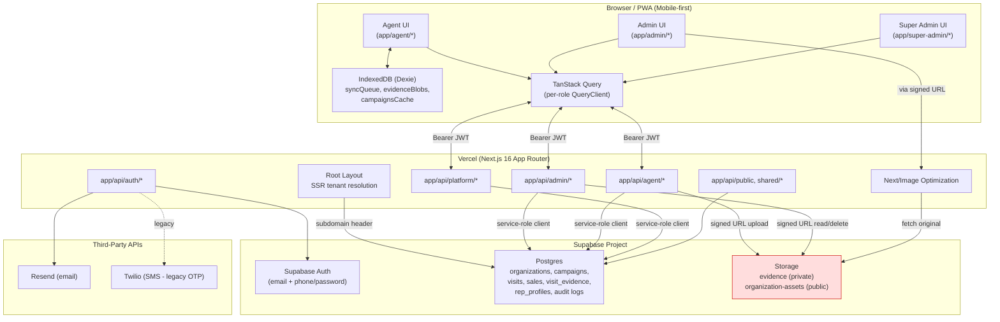
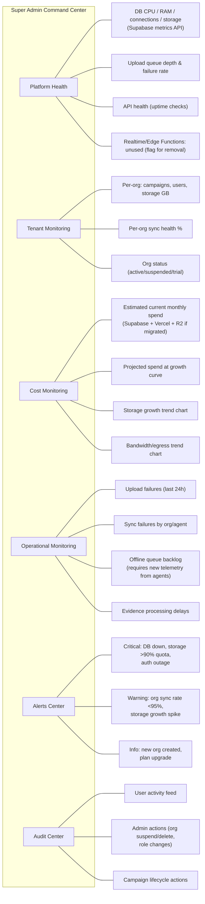
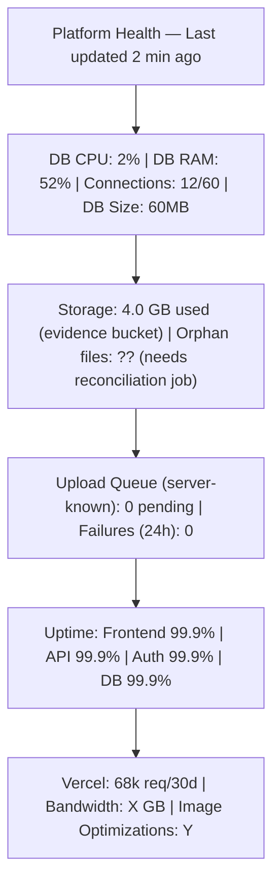
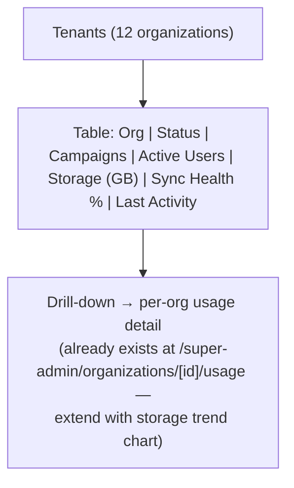
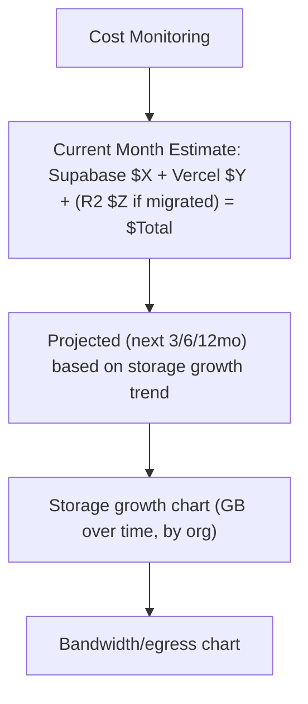
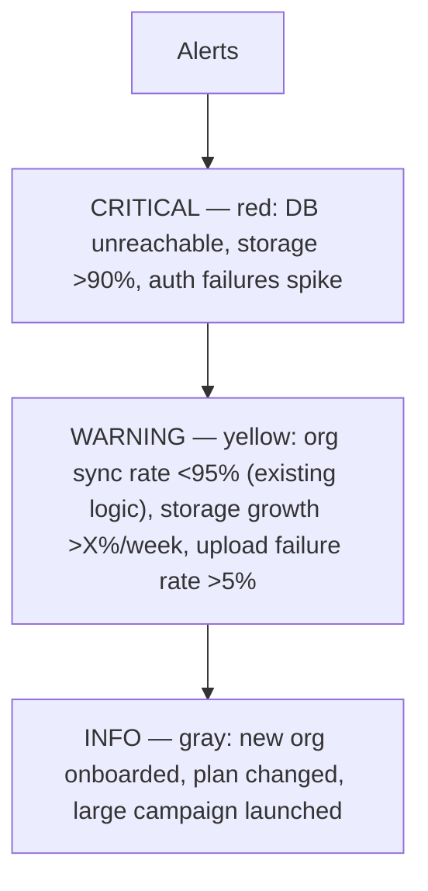
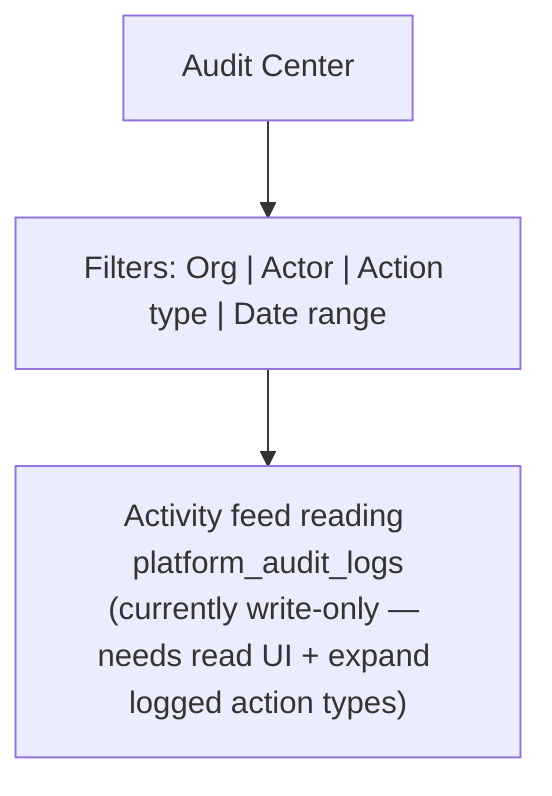

# ActivationIQ Field Operations Platform — Architecture, Cost & Observability Audit

**Date:** 2026-06-12
**Scope:** Full-codebase audit prior to any implementation work
**Stack (as found):** Next.js 16 (App Router) + React 19 + TypeScript, Supabase (Postgres, Auth, Storage), Vercel hosting, Dexie/IndexedDB offline layer, next-pwa.

> Correction to brief: the project is **Next.js 16**, not Vite/CRA. This matters for the cost/optimization phase (Next/Image, Vercel functions, ISR) and is reflected throughout.

---

## PHASE 1 — ARCHITECTURE AUDIT

### 1.1 System Architecture Overview

**Frontend / routing**
- App Router with route groups: `app/(auth)/`, `app/admin/`, `app/agent/`, `app/super-admin/`, `app/shared/`, `app/api/`.
- Root layout (`app/layout.tsx:1-88`) performs SSR tenant resolution from an `x-tenant-subdomain` header, preloads branding + "experience config" (per-tenant terminology/UI variant engine), and wraps the tree in `ThemeProvider`, `PwaRuntimeProvider`, `BrandProvider`, `TenantExperienceProvider`, `Toaster`.
- Each role area has its own layout enforcing access via a server component `RequireRole` (`components/auth/RequireRole.tsx`): admin → `["admin","super_admin"]` + org roles `["org_admin","supervisor"]`; agent → `["agent"]`; super-admin → `["super_admin"]`.
- **No root `middleware.ts`** — all auth/role/tenant enforcement happens in layouts and individual API routes (defense-in-depth gap, see Security Audit).

**State management**
- TanStack Query v5 is the primary data layer. `AppQueryProvider` (`components/providers/AppQueryProvider.tsx`) creates a **separate QueryClient per layout** with `staleTime` 10s (admin "live mode") to 30s (agent), conditional `refetchOnWindowFocus`/`refetchOnReconnect`. No `gcTime` tuning.
- A tiny non-reactive module store (`store/agent-store.ts`) tracks sync status. No Zustand/Redux.
- Tenant "experience config" cached in `localStorage` (24h TTL) with SSR fallback.
- Offline cache: Dexie/IndexedDB with 7 tables (`outlets`, `visits`, `sales`, `syncQueue`, `campaignsCache`, `submissionsCache`, `evidenceBlobs`, `syncLogs`).

**API layer**
- `app/api/{admin,agent,auth,platform,public,shared,sync}` — REST-style route handlers, Bearer-token auth via `lib/auth/server-auth.ts`, every route creates its own Supabase **service-role** client per request (`lib/supabase/server.ts`) and manually filters by `organization_id` derived server-side from `organization_users` membership (not from client input).
- Guard pattern repeated in nearly every route: `getAuthenticatedUserFromRequest()` → `hasRequiredRole()` → `getOrgMembershipForUser()` → `hasAllowedOrgRole()`. No shared middleware/wrapper — duplication risk.

**Supabase integration**
- `lib/supabase/client.ts` — browser client using `NEXT_PUBLIC_SUPABASE_URL` + `NEXT_PUBLIC_SUPABASE_ANON`.
- `lib/supabase/server.ts` — per-request server client using `SUPABASE_SERVICE_ROLE_KEY` (never bundled client-side — verified).
- **RLS is effectively bypassed in practice**: because all server routes use the service-role key, Postgres RLS policies are a secondary safety net, not the primary enforcement. Primary enforcement = application code. (See critical RLS bug below.)

**Authentication flow**
- Supabase Auth, email or phone. Recent migrations (`20260609_phone_auth_support.sql`, `20260609_phone_otp_tokens.sql`, `20260611_phone_password_auth.sql`) show a rapid pivot **from SMS-OTP to password auth** for phone accounts. Phone accounts get a deterministic default password = last 6 digits of the E.164 number (`lib/auth/phone.ts:47-49`), with a `must_change_password` flag — **not yet enforced everywhere** (see Security Audit, HIGH finding).

**Authorization model**
- App-level role in `auth.user.app_metadata.role` ∈ {agent, admin, super_admin}.
- Org-level role in `organization_users.role` ∈ {org_admin, supervisor, agent}.
- Enforced client-side via `RequireRole`, server-side via the guard chain above. Supervisors are additionally path-blocked from `/admin/settings` and `/admin/users`.

**Multi-tenant implementation**
- Tenant = `organizations` row, identified by **subdomain** (`organizations.subdomain`, added `20260609_organization_subdomain.sql`) with slug/cookie fallback.
- Every business table carries `organization_id`; all queries are manually scoped to it.
- Per-tenant UI customization via `organizations.experience_config` JSONB (terminology, modules, dashboards, theme).

**Storage implementation**
- Private `evidence` bucket (`public=false`), object key = `{organization_id}/{visit_id}/{idempotencyKey}-{filename}` — tenant isolation is **path-based + DB-row based**, not storage-RLS based (no `storage.objects` policies found).
- Public `organization-assets` bucket for branding/logos (created on-demand, 5MB cap).
- Access via 1-hour signed URLs generated server-side.

**Offline / sync**
- Dexie queue with idempotency keys, exponential backoff (`min(300, 2^retryCount * 5)`s, max 5 retries), statuses `queued → retrying → synced/duplicate/failed_retryable/failed_terminal`.
- Background sync every 30s + on `online`/`visibilitychange` events, cleaned up properly on unmount.
- Evidence photos: client-side canvas compression (max width 1280px, JPEG/WebP @ 0.7 quality) before being queued as Dexie blobs, then uploaded via `/api/agent/sync/batch` and `/api/agent/visits/[id]/evidence`.

### 1.2 Architecture Diagram

### 1.3 Infrastructure Dependency Audit

| Dependency | Purpose | Criticality | Cost Impact | Scaling Risk | Vendor Lock-in |
|---|---|---|---|---|---|
| **Supabase Postgres** | All relational data (campaigns, visits, sales, evidence metadata, orgs, auth profiles) | Critical | Low today (60MB, 2% CPU) | Low at current scale; reporting queries do client-side aggregation (risk grows with row counts) | Medium — schema is portable Postgres, but RLS/auth helper functions and `auth.users` integration are Supabase-specific |
| **Supabase Auth** | Email + phone/password login, JWT issuance, invite flow | Critical | Included in plan | Low | High — `organization_users.user_id` FKs to `auth.users`; migrating auth means rewriting all FK relationships |
| **Supabase Storage** | Evidence photos (private), org branding assets (public) | Critical | **Highest current/future cost driver** — 4GB now, projected to TB-scale | High — storage + egress billing scales linearly with image volume; this is the dominant future cost | Medium — S3-compatible-ish but signed-URL/RLS model is Supabase-specific; migration is mechanical (re-point upload/read paths) |
| **Supabase Realtime** | **Not used anywhere** (no `.channel()` calls found) | None currently | None | None | N/A — currently dead weight in the plan |
| **Supabase Edge Functions** | **Not used** — all logic lives in Next.js API routes | None | None | None | N/A |
| **Vercel (hosting + functions)** | Next.js SSR/API routes, Next/Image optimization, PWA serving | Critical | Bandwidth + image-optimization transformations scale with traffic and image count | Medium — Next/Image transformation costs scale with unique image×size combos; 68k requests/month is currently modest | Medium — Next.js-specific but portable to any Node host |
| **Resend** | Transactional email (invites, password reset) | High | Low (volume-based, low volume currently) | Low | Low — easily swappable |
| **Twilio** | Legacy SMS OTP — migration to password auth makes this **largely dead code/infra** | Low (legacy) | Ongoing cost if account/number still active | None | Low |

**Notable findings:**
- Supabase Realtime and Edge Functions are provisioned capabilities that are **entirely unused** — no cost today, but worth confirming they're not silently billed (e.g., Realtime connection minutes).
- Twilio appears to be **vestigial** after the OTP→password migration (`20260611_phone_password_auth.sql`). Recommend confirming the Twilio number/account isn't still accruing monthly charges.

### 1.4 Database Audit

**Schema** — 14+ tables, consistently carry `organization_id` (tenant scoping). Key tables: `organizations`, `organization_users`, `profiles`, `rep_profiles`, `campaigns`, `campaign_assignments`, `campaign_share_links/_views`, `outlets`, `sales`, `sale_evidence`, `visits`, `visit_evidence`, `product_catalog`, `platform_settings`, `platform_audit_logs`, `phone_otp_tokens`.

**Indexes** — 32 indexes total, mostly well-designed compound indexes of the form `(organization_id, <fk>, created_at DESC)` covering the dominant "list X for org Y, newest first" query pattern.

**Gaps identified:**
1. **`visits.outcome` and `sales.conversion_status`** have no standalone/leading index — dashboard filters by outcome will scan the compound index inefficiently as data grows.
2. **`platform_audit_logs` is completely unindexed** and has **RLS disabled with no policies** — currently write-only and would full-scan if ever queried; also `actor_user_id` has no FK (dangling references possible).
3. **`platform_settings`** also has RLS disabled, no policies — accessible only via service-role (acceptable for now, but undocumented).
4. **`phone_otp_tokens`** has no TTL/cleanup job — will grow unbounded (low volume, low risk, but should be addressed).
5. **`visits.outlet_id → outlets` is `ON DELETE CASCADE`**, while `sales.visit_id → visits` is `ON DELETE SET NULL` — deleting an outlet cascades to delete visits, potentially orphaning sales records that still reference the visit_id (now null) — a data-integrity inconsistency worth reviewing.
6. **`visit_evidence.deleted_by`** and **`platform_audit_logs.actor_user_id`** have no FK to `auth.users`.

**Reporting / aggregation:**
- `lib/reporting/aggregateCampaignPerformance.ts` and `/api/platform/dashboard/summary` fetch **entire `visits`/`sales` tables for an org (or all orgs, for the super-admin dashboard)** and aggregate in JavaScript — no `GROUP BY`/SQL aggregates, no date-range pushdown on the main select. At current volumes (60MB DB) this is fine; at 100k+ visits per org this becomes a real latency and memory problem on every dashboard load (no caching).
- `getCampaignEvidence` joins `visit_evidence` to `visits` for campaign-scoped evidence without a dedicated index covering `(organization_id, campaign_id via visits, created_at)` — acceptable now, will need either a denormalized `campaign_id` column on `visit_evidence` or a materialized view at scale.

### 1.5 Storage Audit

**Upload flows found:**
1. **Evidence photos** (the dominant flow): `app/agent/campaigns/[id]/visit/start/page.tsx` → client-side canvas compression (≤1280px width, JPEG/WebP @ 0.7) → Dexie `evidenceBlobs` (offline) or direct POST → `app/api/agent/visits/[id]/evidence/route.ts` → `evidence` bucket, path `{org_id}/{visit_id}/{idempotencyKey}-{filename}` → row in `visit_evidence` with both original and compressed size metadata.
2. **Organization branding/logo**: `app/api/platform/organizations/logo-upload/route.ts` → public `organization-assets` bucket, 5MB cap.

**Rendering:** `components/shared/EvidenceGallery.tsx` uses Next/Image with 1-hour signed URLs, `loading="lazy"`, paginated at 20 items per page (admin campaign details, shared campaign view, outlet details).

**Key data point — compression effectiveness:**
- Current production data: **2,300 images = 4GB ⇒ ~1.78MB average per stored image.**
- The client-side compression pipeline targets ≤1280px JPEG/WebP @ 0.7 quality, which typically produces **100–300KB** files.
- **This ~6-15x discrepancy strongly suggests either**: (a) compression isn't applied to all upload paths (e.g., evidence captured via certain flows bypasses `compressEvidencePhoto`), (b) `original_file_size` is being stored/uploaded rather than the compressed version in some path, or (c) devices are producing very large source images that even 1280px/0.7 JPEG doesn't shrink as expected (e.g., already-compressed JPEGs re-encoded don't always shrink much, or images contain large embedded metadata/EXIF + thumbnails). **This is the single highest-leverage finding for cost control** — fixing it could cut storage growth 6-15x before any infrastructure migration.

**File cleanup / orphan risk:**
- Soft-delete (`visit_evidence.deleted_at`) does **not** remove the storage object.
- Individual delete (`/api/admin/evidence/[id]`) does call `storage.remove()`, but failures are only logged, not retried — orphan files accumulate silently.
- Campaign delete cascades storage removal in a batch; partial failures are logged as warnings without reconciliation.
- **No reconciliation job** exists to find storage objects with no matching `visit_evidence` row (or vice versa) — storage usage reported in the super-admin "usage" page is **DB-row-derived (`SUM(file_size)`), not actual bucket size**, so it will under-report true storage cost as orphans accumulate.

**Projected storage & bandwidth growth**

Using the observed **current average of ~1.78MB/image** (current trajectory) vs. a **target average of ~200KB/image** (if compression pipeline is fixed/enforced everywhere):

| Images | Storage @ 1.78MB avg (current trajectory) | Storage @ 200KB avg (optimized) |
|---|---|---|
| 100,000 | ~178 GB | ~20 GB |
| 500,000 | ~890 GB | ~100 GB |
| 1,000,000 | ~1.78 TB | ~200 GB |

Bandwidth (egress) is harder to predict precisely — it depends on how often evidence is re-viewed (admin review, share links, reports). As a planning assumption, **monthly egress ≈ 20-30% of cumulative stored bytes** is reasonable for an active multi-tenant ops platform (older campaigns are reviewed less). Cost tables in Phase 2 use this assumption explicitly.

### 1.6 Frontend Audit

| Area | Finding |
|---|---|
| React Query | Generally good — array query keys with filters, server-side pagination for admin lists (reps/users/outlets at pageSize=20). **Inconsistent**: `useCampaignDetailsPage.ts` uses raw `fetch()` + manual state for activities/evidence/intelligence instead of React Query, losing caching/dedup. |
| Re-renders | `CampaignDetailsSections.tsx` (990 lines) has memoized chart data but **inline lambdas for filter/pagination handlers** passed to children every render; `CampaignPointMap` re-initializes Leaflet on a numeric `resizeTrigger` prop change. |
| Bundle size | **recharts, leaflet, react-leaflet-cluster, hugeicons all imported eagerly** at the top of campaign-details and dashboard pages — no `next/dynamic` for charts/maps despite them being tab-specific. Only 2 files use dynamic imports project-wide. |
| Pagination | Server-side pagination correct for admin list pages. Campaign-details "assigned reps" table fetches all rows then slices client-side (`REPS_PAGE_SIZE`, the component in the user's IDE selection) — low risk while rep counts are <100/campaign, but will waste bandwidth if campaigns scale to hundreds of reps. |
| Offline/Dexie | `evidenceBlobs` has **no size cap or TTL** — failed/terminal sync items keep their blobs forever, risking IndexedDB quota exhaustion on agent devices (typically 50MB-ish effective quota on mobile Safari). |
| Realtime/leaks | No Supabase Realtime usage anywhere (confirmed no `.channel()`). Background sync interval and PhotoCapture object-URLs are cleaned up correctly — no leaks found. |

### 1.7 Security Audit — Key Findings

| Severity | Finding | Evidence |
|---|---|---|
| **CRITICAL** | RLS policies for `is_super_admin()`/`is_org_member()` call `public.current_app_role()`, which is **never defined in any migration**. RLS-dependent policies will either error out or silently fail-open depending on how Postgres handles the missing function under the current grants. Since all app routes use the service-role key (bypassing RLS), this hasn't caused a visible incident — but it means **RLS provides zero actual defense-in-depth today**, and any future code path that uses the anon/authenticated client (e.g., a future client-side Supabase query) would be unprotected or error. | `supabase/migrations/20260506_platform_foundation.sql:72-78` |
| **HIGH** | Phone-auth default password = last 6 digits of the phone's E.164 number — deterministic, 10^6 search space, **derivable by anyone who knows the agent's phone number**. `must_change_password` flag exists but enforcement was not confirmed across all entry points. | `lib/auth/phone.ts:47-49` |
| **HIGH** | Phone login error messages distinguish "not registered" from "wrong password" — **account-enumeration vector** for phone numbers. | `app/(auth)/login/page.tsx:193-194` |
| **MEDIUM** | No root `middleware.ts` — auth/role enforcement relies entirely on per-layout/per-route checks. Works today (all routes checked), but is fragile against future routes that forget the guard chain. |
| **MEDIUM** | `scripts/register-kano-agents.mjs` contains **100+ real agent names/phone numbers (PII) and a hardcoded organization UUID**, committed to git history. `scripts/setup-test-accounts.mjs` has hardcoded test passwords. Both use the service-role key directly with no dry-run/environment guard. |
| **LOW** | No explicit `storage.objects` RLS policies — evidence bucket is private and access is gated entirely by signed URLs generated server-side after an org-membership check. Acceptable, but undocumented/implicit. |
| **None found** | No privilege-escalation path from org-admin → super-admin; last-super-admin demotion is blocked. |

**Positive findings:** service-role key is never bundled client-side; `NEXT_PUBLIC_*` vars are correctly limited to URL/anon-key/app-url; tenant isolation via `organization_id` is consistently derived server-side from session, never trusted from client input.

---

## PHASE 2 — COST OPTIMIZATION REVIEW

> **Pricing assumptions (verify against current vendor pricing before committing budget — these are directional estimates):**
> - Supabase Pro: $25/mo base, includes 100GB storage + 250GB egress; overage storage $0.021/GB-mo, overage egress $0.09/GB.
> - Cloudflare R2: $0.015/GB-mo storage, **egress to internet free**, Class A ops (writes) $4.50/M, Class B ops (reads) $0.36/M.
> - Backblaze B2: $0.006/GB-mo storage, egress free via Bandwidth Alliance (e.g., paired with Cloudflare), Class B ops ~$0.01/10k.
> - AWS S3 Standard: ~$0.023/GB-mo storage, $0.09/GB egress.
> - Vercel Pro: $20/mo/seat base; Image Optimization beyond included transformations billed per 1,000 source images (~$5-9/1000); bandwidth overage ~$0.15/GB.
> - Monthly egress modeled at **25% of cumulative stored bytes** (active-campaign review pattern).

### Cost projection inputs

| Images | Storage @ current 1.78MB avg | Storage @ optimized 200KB avg | Monthly egress @ 25% (current avg) | Monthly egress @ 25% (optimized) |
|---|---|---|---|---|
| 100,000 | 178 GB | 20 GB | 44.5 GB | 5 GB |
| 500,000 | 890 GB | 100 GB | 222.5 GB | 25 GB |
| 1,000,000 | 1,780 GB | 200 GB | 445 GB | 50 GB |

### Option A — Current architecture (Supabase Storage + Vercel, unchanged)

Using **current 1.78MB/image trajectory** (worst case if compression bug isn't fixed):

| Images | Storage cost/mo | Egress cost/mo | **Total/mo** | **Total/yr** |
|---|---|---|---|---|
| 100,000 | $25 + (78GB×$0.021) ≈ $26.6 | (44.5−250 incl.)=$0 | **~$27** | **~$320** |
| 500,000 | $25 + (790GB×$0.021) ≈ $41.6 | (222.5−250)=$0 | **~$42** | **~$500** |
| 1,000,000 | $25 + (1680GB×$0.021) ≈ $60.3 | (445−250)×$0.09≈$17.6 | **~$78** | **~$935** |

If the **compression bug is fixed** (200KB avg), all three tiers stay near the $25-30/mo Supabase base — costs become negligible from a storage perspective. **Vercel** image-optimization and bandwidth costs are additive and grow with the number of *unique* images rendered, independent of which storage backend holds them.

- **Complexity:** None (status quo)
- **Migration effort:** None
- **Vendor lock-in:** Medium (existing)
- **Recommended?** **Only if the compression fix is applied first.** Otherwise this option's storage cost scales linearly and unfavorably, and Supabase storage overage pricing ($0.021/GB) is ~1.4-3.5x more expensive than R2/B2.

### Option B — Supabase (metadata/DB only) + Cloudflare R2 (images)

R2 cost = storage + read ops (egress is free):

| Images | Storage (1.78MB avg) | Storage (200KB avg) | R2 cost @1.78MB avg/mo | R2 cost @200KB avg/mo |
|---|---|---|---|---|
| 100,000 | 178GB → $2.67 | 20GB → $0.30 | ~$3 (+ read ops, negligible at this volume) | ~$1 |
| 500,000 | 890GB → $13.35 | 100GB → $1.50 | ~$14 | ~$2 |
| 1,000,000 | 1,780GB → $26.70 | 200GB → $3.00 | ~$28 (+ ~$0.36-3.6 read ops depending on view volume) | ~$4 |

Plus Supabase Pro base ($25/mo) for DB/Auth (storage component drops to near-zero since images move out).

| Images | **Total/mo (current 1.78MB)** | **Total/yr** | **Total/mo (optimized 200KB)** | **Total/yr** |
|---|---|---|---|---|
| 100,000 | ~$28 | ~$340 | ~$26 | ~$310 |
| 500,000 | ~$40 | ~$475 | ~$27 | ~$320 |
| 1,000,000 | ~$55 | ~$655 | ~$29 | ~$345 |

- **Complexity:** Medium — introduce an R2 client, re-point upload/signed-URL logic, migrate existing 4GB of objects.
- **Migration effort:** ~3-5 days (upload path, signed-URL/read path, one-time bulk migration script + dual-read fallback during cutover).
- **Vendor lock-in:** Low — R2 is S3-API-compatible.
- **Recommended?** **Yes** — biggest cost/complexity ratio improvement, R2's free egress eliminates the largest variable cost as bandwidth grows.

### Option C — Supabase + R2 + Cloudflare CDN (in front of R2)

Same storage economics as Option B, but a Cloudflare CDN/cache layer in front of R2 (e.g., a custom domain with caching rules, or Cloudflare Images for on-the-fly resizing) reduces R2 Class B read operations for frequently-viewed evidence (e.g., shared campaign links, repeated admin review) and enables **on-the-fly thumbnail generation** instead of shipping full compressed images to gallery grids.

| Images | Incremental cost over Option B |
|---|---|
| Any | Cloudflare CDN: free (Cloudflare's standard CDN caching is free on any plan when using a CNAME'd custom domain). Optional **Cloudflare Images** (for resize/transform): $5/mo per 100k images stored + $1/mo per 100k delivered transformations — add ~$5-15/mo at 500k-1M images if used for thumbnails. |

- **Complexity:** Medium-High — adds a CDN/caching layer and optionally a transformation service; requires cache-invalidation strategy for deleted/replaced evidence.
- **Migration effort:** Option B effort + 1-2 days for CDN/custom-domain setup and (optionally) Cloudflare Images integration.
- **Vendor lock-in:** Low (still S3-compatible underneath; CDN layer is swappable).
- **Recommended?** **Yes, as a phase-2 follow-on to Option B** — not urgent at current 4GB scale, but becomes valuable once evidence galleries are heavily browsed (admin review workflows, shared campaign links) or once on-the-fly thumbnailing is needed to stop shipping full images to grid views.

### Option D — Alternative: Backblaze B2 + Cloudflare (Bandwidth Alliance)

B2 storage is ~2.5x cheaper than R2 per GB, and **egress is free when paired with Cloudflare** (Bandwidth Alliance):

| Images | Storage (1.78MB avg) | Storage (200KB avg) | B2 cost/mo |
|---|---|---|---|
| 100,000 | 178GB → $1.07 | 20GB → $0.12 | ~$1-2 |
| 500,000 | 890GB → $5.34 | 100GB → $0.60 | ~$5-6 |
| 1,000,000 | 1,780GB → $10.68 | 200GB → $1.20 | ~$11-13 |

| Images | **Total/mo (incl. Supabase Pro $25 base)** | **Total/yr** |
|---|---|---|
| 100,000 | ~$26-27 | ~$315 |
| 500,000 | ~$30-31 | ~$365 |
| 1,000,000 | ~$36-38 | ~$445 |

- **Complexity:** Medium — same as R2 (S3-compatible API), plus Cloudflare CNAME/Bandwidth-Alliance setup for free egress.
- **Migration effort:** Similar to Option B, ~3-5 days.
- **Vendor lock-in:** Low.
- **Recommended?** **Best raw cost** at scale, but R2 (Option B/C) is recommended over B2 for this stack because: (1) Cloudflare R2 + Cloudflare CDN gives a single-vendor combo for storage+delivery+future Workers/Images, simplifying ops; (2) the cost delta between R2 and B2 at 1M images (~$28 vs ~$13/mo) is small in absolute terms and doesn't justify a second vendor relationship. **B2 becomes worth revisiting only beyond several million images**, where the 2.5x storage-cost gap becomes material.

### Summary Recommendation

| Option | Monthly @ 1M images (optimized compression) | Complexity | Migration | Lock-in | Recommended |
|---|---|---|---|---|---|
| A — Status quo | ~$29-78 (depends on fixing compression) | None | None | Medium | Only after fixing compression bug |
| **B — Supabase + R2** | **~$29** | Medium | ~3-5 days | Low | **Yes — primary recommendation** |
| C — Supabase + R2 + CDN | ~$29-44 | Medium-High | +1-2 days over B | Low | Yes, as phase 2 |
| D — Supabase + B2 + Cloudflare | ~$36-38 | Medium | ~3-5 days | Low | Only if scaling past several million images |

**The single highest-impact action is fixing the image-compression discrepancy (1.78MB vs ~200KB expected)** — this alone reduces storage by up to 90% regardless of which backend is chosen, and should be done *before* any storage migration so the migration moves less data.

---

## PHASE 3 — OBSERVABILITY & MONITORING REVIEW

### Current state: **no monitoring exists**

- No Sentry/LogRocket/Datadog/PostHog/Vercel Analytics in `package.json` or `next.config.ts`.
- No error boundaries reporting to an external service.
- `platform_audit_logs` table exists and is written to for 3 actions (user role change, invite resend, settings update) but is **never read** — no audit UI.
- Super-admin dashboard computes some "incident" signals (per-org sync rate <95%) but via full-table scans with no caching, and only on-demand when the page loads (no alerting/push).

### Recommendations

**Error Monitoring**
- **Sentry** (recommended) — first-class Next.js 16 App Router SDK, captures both client and server (API route) errors, source maps, release tracking. Free tier covers current 68k req/month easily; paid tier (~$26/mo team plan) as volume grows.
- Alternative: **Better Stack** (formerly Logtail) — simpler, combines logs + uptime + incident management in one tool, good fit if consolidating vendors.

**Uptime Monitoring** (Better Stack, UptimeRobot, or Checkly — pick one):
- Frontend: HTTPS check on root domain + a representative tenant subdomain (catches subdomain-routing breakage).
- API: `/api/sync` health endpoint (already exists) on a 1-5 min interval.
- Auth: synthetic check hitting `/api/auth/context` with a test token (catches Supabase Auth outages).
- Database: a lightweight `/api/health/db` endpoint doing `SELECT 1` against Postgres via service-role client.

**Infrastructure Monitoring**
- Database CPU/RAM/connections/storage: Supabase's built-in project dashboard already exposes these — pipe to an external dashboard via Supabase's metrics/log-drain API (or just check periodically; at 2% CPU/52% RAM/12-60 connections this is not urgent, but RAM at 52% on a 60MB DB warrants understanding — likely shared-pool baseline on the smallest instance tier, worth confirming instance size vs. headroom for growth).
- Storage usage / image counts / upload failures: **does not exist today**. Needs:
  - A scheduled job (Vercel Cron or Supabase Edge Function) that reconciles `SUM(visit_evidence.file_size WHERE deleted_at IS NULL)` against actual bucket size (catches orphans).
  - Upload failure tracking — currently failures are only visible in the agent's local sync queue (`syncLogs`); no aggregation to a platform-wide view.
- Vercel bandwidth / image optimization / function executions: available in Vercel's dashboard/Analytics — not currently surfaced anywhere in-app; should be pulled into the Super Admin cost view (Phase 4) via Vercel's API.

**Business Monitoring** — none of the following currently exist and would need new queries/tables:
- Active campaigns, active users, submissions/hour & /day — derivable from `visits`/`sales`/`campaigns` with proper date-bucketed SQL aggregates (not the current full-table-scan-and-filter-in-JS approach).
- Conversion rates — `sales.conversion_status` already exists; needs a SQL view.
- Image uploads, failed submissions — `visit_evidence` count + `syncLogs`/`syncQueue` failed-status counts.
- Sync backlog — `syncQueue` is **client-side IndexedDB only**; the platform has **no server-side visibility into how many records are stuck offline on agent devices**. This is a real operational blind spot — agents could have hundreds of unsynced visits and admins would have no way to know.

---

## PHASE 4 — SUPER ADMIN EVOLUTION

### Current state classification

Based on the audit, the existing Super Admin area is a **basic CRUD administration portal with a thin layer of operational metrics** — it is **not** an operational command center and **not** an infrastructure dashboard:

- ✅ CRUD: organizations, users/roles, campaigns (cross-tenant list), settings — all list/detail/edit pages.
- ⚠️ Partial ops telemetry: dashboard shows sync-success-rate, "freshness under 5 min", invite-completion %, and a basic per-org "incident" flag (sync rate <95%) — but computed via full-table scans with no caching, no alerting, no history/trends.
- ❌ No infrastructure health (DB CPU/RAM/connections, storage bucket size, function execution counts, uptime).
- ❌ No cost visibility (no spend tracking at all).
- ❌ Audit log is write-only — no viewer UI, and most destructive actions (org suspend/delete, campaign delete) aren't logged at all.
- ❌ No alerting (no critical/warning/info classification anywhere).

### Proposed Super Admin Command Center — structure

### Wireframe — Platform Health page

### Wireframe — Tenant Monitoring page

### Wireframe — Cost Monitoring page (new)

### Wireframe — Alerts Center (new)

### Wireframe — Audit Center (new)

---

## PHASE 5 — IMPLEMENTATION PLAN

Prioritized by cost savings × reliability × scalability × visibility ÷ effort.

### 1. Quick wins (1-2 days)

1. **Investigate and fix the image-compression discrepancy** (1.78MB actual vs ~200KB expected). Highest cost-savings-per-effort item in the entire audit — potentially 6-15x storage reduction. *Audit only — needs root-cause first (which upload path(s) skip/under-compress).*
2. **Add `idx_visits_org_outcome` and `idx_sales_org_conversion_status` indexes** for dashboard filters.
3. **Define or remove the missing `public.current_app_role()` RLS function** — close the critical RLS gap (define it properly even though service-role bypasses it, for defense-in-depth and to unblock any future client-side Supabase usage).
4. **Fix phone-auth enumeration message** in `app/(auth)/login/page.tsx:193-194` — use a generic error for both "not registered" and "wrong password".
5. **Remove/rotate Twilio if unused** post OTP→password migration — direct cost savings.
6. **Add FK from `visit_evidence.deleted_by` and `platform_audit_logs.actor_user_id` to `auth.users`**.

### 2. Short-term improvements (1-2 weeks)

1. **Strengthen phone-auth default passwords** — random per-account temp password (not derivable from phone number) + enforce `must_change_password` on first login across all entry points.
2. **Remove/secure the Kano agent scripts** — strip hardcoded PII/org IDs from git history or move to a secrets-managed config; add dry-run + environment guard.
3. **Add root `middleware.ts`** for centralized auth/role/tenant routing as defense-in-depth.
4. **Dynamic-import recharts/leaflet/hugeicons** on campaign-details and dashboard pages — bundle size reduction, faster mobile loads (directly benefits the mobile-first agent UX too).
5. **Add storage reconciliation job** (Vercel Cron / Supabase scheduled function) comparing `SUM(visit_evidence.file_size)` to actual bucket usage, and retrying failed `storage.remove()` calls.
6. **Integrate Sentry** for error monitoring (client + API routes) — immediate visibility into the current "production-blind" state.
7. **Add uptime checks** (frontend, `/api/sync`, `/api/auth/context`, DB health endpoint).
8. **Migrate campaign-details data fetching to React Query** (`useCampaignDetailsPage.ts`) for consistency and caching.

### 3. Medium-term improvements (1-2 months)

1. **Migrate evidence photo storage to Cloudflare R2** (Option B) — re-point upload/signed-URL/delete paths, bulk-migrate existing 4GB, dual-read fallback during cutover. Do this *after* the compression fix so less data moves.
2. **Build SQL-side aggregation (views/RPC functions)** for dashboard metrics (sync rate, conversion rate, submissions/day) to replace full-table-scan-and-filter-in-JS, with appropriate caching (e.g., materialized views refreshed on a schedule, or short-TTL response caching).
3. **Build the Cost Monitoring view** in Super Admin — pull Supabase storage/DB metrics + Vercel bandwidth/image-optimization usage via their APIs, combine with R2 billing once migrated.
4. **Add server-side visibility into offline sync backlog** — agents periodically report queue depth/oldest-pending-item to a lightweight endpoint so admins can see "agent X has 47 unsynced visits from 3 days ago".
5. **Build the Audit Center read UI** and expand logged actions to cover org suspend/delete, campaign delete, evidence delete.
6. **Add TTL/cleanup for `evidenceBlobs` (failed_terminal) and `phone_otp_tokens`.**

### 4. Long-term architecture evolution (6-12 months)

1. **Cloudflare CDN + on-the-fly image transformation (Option C)** in front of R2 — eliminates shipping full-size images to gallery grids, reduces both bandwidth and client-side render cost.
2. **Full Alerts Center** with critical/warning/info tiers wired to Sentry + uptime checks + the new storage/sync metrics, with notification delivery (email/Slack).
3. **Materialized reporting layer** (scheduled rollups per org/day) to keep dashboards fast as `visits`/`sales` grow into millions of rows — revisit Backblaze B2 (Option D) only if storage volume grows into multi-TB territory where its ~2.5x cost advantage over R2 becomes material.
4. **Formal data-retention policy** for evidence photos (tie into the existing but unused `platform_settings.default_media_retention_days`) with automated archival/deletion for old campaigns, directly bounding long-term storage costs.

---

*This report documents findings only. No code or infrastructure changes have been made. Each Phase 5 item should be scoped into its own task/PR before implementation.*
